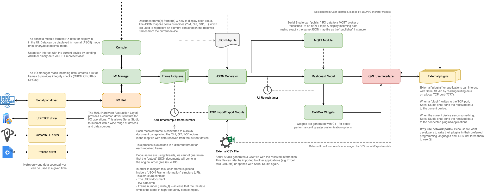

<a href="#">
    
</a>

# Serial Studio

[](https://github.com/Serial-Studio/Serial-Studio/commits/master)
[](https://github.com/Serial-Studio/Serial-Studio/graphs/contributors)
[](https://github.com/Serial-Studio/Serial-Studio/pull/new)
[](https://www.codacy.com/gh/Serial-Studio/Serial-Studio/dashboard?utm_source=github.com&amp;utm_medium=referral&amp;utm_content=Serial-Studio/Serial-Studio&amp;utm_campaign=Badge_Grade)
[](https://github.com/Serial-Studio/Serial-Studio/releases/)
[](CODE_OF_CONDUCT.md)
[](https://www.paypal.com/donate?hosted_button_id=XN68J47QJKYDE)

Serial Studio is a simple, multi-platform, and multi-purpose serial data visualization program that allows embedded developers to visualize, analyze, and present data generated from their projects and devices while avoiding the need to write project-specific visualization software.

Over my many CanSat-based competitions, I found myself writing and maintaing several Ground Station Softwares for each program. However, I decided that it would be easier and more sustainble to define one flexible Ground Station Software that lets developers define how each CanSat presents data using an extensible communication protocol for easy data visualization. Developers can also use Serial Studio for almost any data acquisition and visualization project outside of CanSat, now supporting data retrieval from a hardware serial ports, software serial ports, MQTT, and network sockets (TCP/UDP).

*Read this in other languages*: [Español](doc/README_ES.md) [简体中文](doc/README_ZH.md) [Deutsch](doc/README_DE.md)


## Install

You can [download](https://github.com/Serial-Studio/Serial-Studio/releases/latest) and install Serial Studio for your preferred platform.

GNU/Linux users must enable the `executable` flag before attempting to run the application:

```bash
chmod +x SerialStudio-1.1.1-Linux.AppImage
./SerialStudio-1.1.1-Linux.AppImage
```

You can also use the [AppImageLauncher](https://github.com/TheAssassin/AppImageLauncher/) to integrate Serial Studio with your system.

### Prebuilt Linux packages

Arch Linux users can install [serial-studio-git](https://aur.archlinux.org/packages/serial-studio-git/) from the aur, e.g. with [aurutils](https://aur.archlinux.org/packages/aurutils/):

```bash
aur fetch serial-studio-git
aur build
sudo pacman -S serial-studio-git
```

## Licence

This project is released under the MIT license, for more information, check the [LICENSE](LICENSE.md) file.

## Development

### Requirements

The only requirement to compile the application is to have [Qt](http://www.qt.io/download-open-source/) installed in your system. The desktop application will compile with **Qt 5.15**.

On GNU/Linux systems, you will also need to install `libgl1-mesa-dev` in order to compile the application.

Full list of used Qt modules:

- Qt SVG
- Qt Quick
- Qt Widgets
- Qt Networking
- Qt Serial Port
- Qt Print Support
- Qt Quick Widgets
- Qt Quick Controls 2

### Cloning

This repository makes use of [`git submodule`](https://git-scm.com/book/en/v2/Git-Tools-Submodules). In order to clone it, execute these commands on your Terminal:

	git clone https://github.com/Serial-Studio/Serial-Studio
	cd Serial-Studio
	git submodule init
	git submodule update

Alternatively, just run:

	git clone --recursive https://github.com/Serial-Studio/Serial-Studio

### Compiling the application

Once you have Qt installed, open *Serial-Studio.pro* in Qt Creator and click the "Run" button.

Alternatively, you can also use the following commands:

	qmake
	make -j4
	
### Software architecture

This is a simplified diagram that explains how the different Serial Studio modules interact with each other. You can find the DOXYGEN documentation by clicking [here](https://serial-studio.github.io/hackers/).


	
## Tipping

If you find Serial Studio suitable for your needs, please consider [giving me a tip through PayPal](https://www.paypal.com/donate?hosted_button_id=XN68J47QJKYDE). Or, if you prefer to buy me a drink *personally* instead, just [send me a DM](https://instagram.com/aspatru) when you visit [Querétaro, Mexico](https://en.wikipedia.org/wiki/Querétaro), where I live. I look forward to meeting you!


